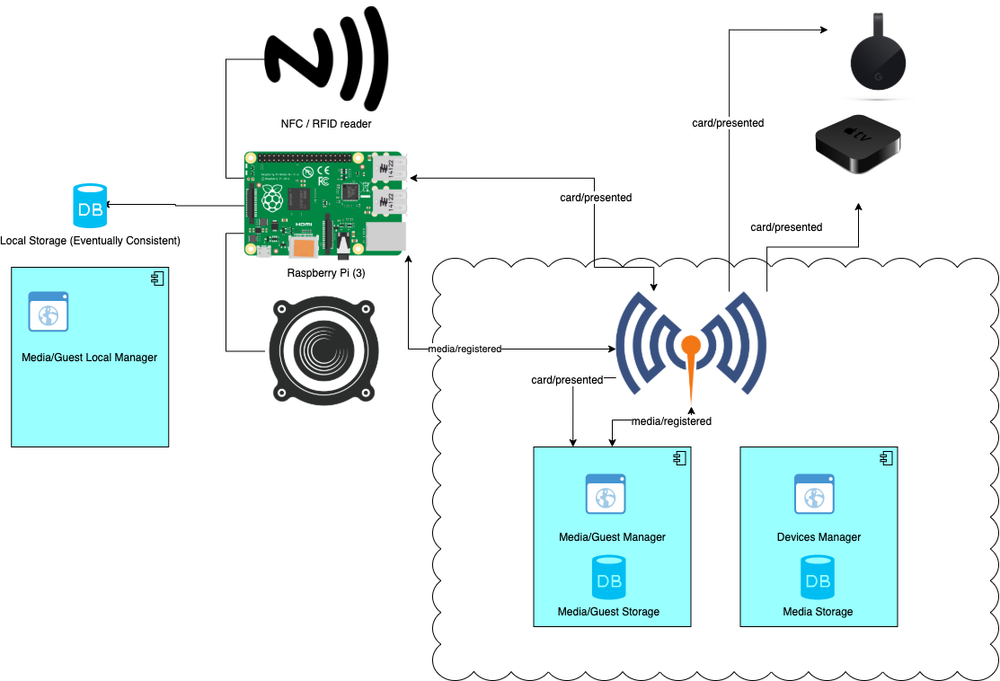

# Architectural Overview

Building Jukeberry will be an incremental development. However, I am throwing a draft of the thought architecture for future reference and compiling ideas. This information could, should and will evolve as the development does.

## Diagram

The diagram above shows the main components and regions.

* There is an MQTT broker that will communicate different components in an event-based maneer.
* The Raspberry Pi is where the Jukebox magic happends. It reads the RFID cards and produces a message to the "card/presented" channel.
* The Raspberry Pi is also consuming that message in order to play a song. While that's a nice, homogeneous, and [flexible[1]](#flexible-arch) architecture, it might be an overkill and makes the Jukebox dependant on other components (and Intenet). For that reason, there could be a simpler mode (only for the local device) to start playing right away (an internal event).
* The Raspberry Pi will count with a lightway database as local storage. It won't be the source of truth but a replica for reducing latency and being independent from the remaining infraestructure.
* Other devices (running compatible clients) will be able to register to Jukeberry (Devices Manger needs to be further thought of). When doing so, these will also consume from the "card/presented" channel. Queueing must be rethought. If the queue is not stored on the player device, note every "card read" event should be delivered (or these shouln't always trigger playing a song)
* The Raspberry will consume messages from the "media/registered" channel and react by replicating the corresponding data in the DB. It's still pending to think what happens when those events are thrown while the Raspberry is offline (event-streaming? An ad-hoc implementation?). 
* Registering media on the *online* media manager will lack the feature of associating the RFID. It will make the media available at the Raspberry. Once there, the Local Media manager will allow to scan a card and choose a previously uploaded song.
* The local media manager will also allow uploading songs. When doing that, the Raspberry will produce a message on the media/registered channel.
* Guests Manager work similar to Media Manager. It will also allow people to register and work with their profiles. The guest will be able to work online (far from the Raspberry), upload songs, change their default song, and all that information will be associated with their personal RFID card (which can be previously or afterly scanned)

<a name="flexible-arch">1. Flexible</a>: By doing that, the player reacts to the event no matter how it was generated (RFID, UI, a different device, etc).
